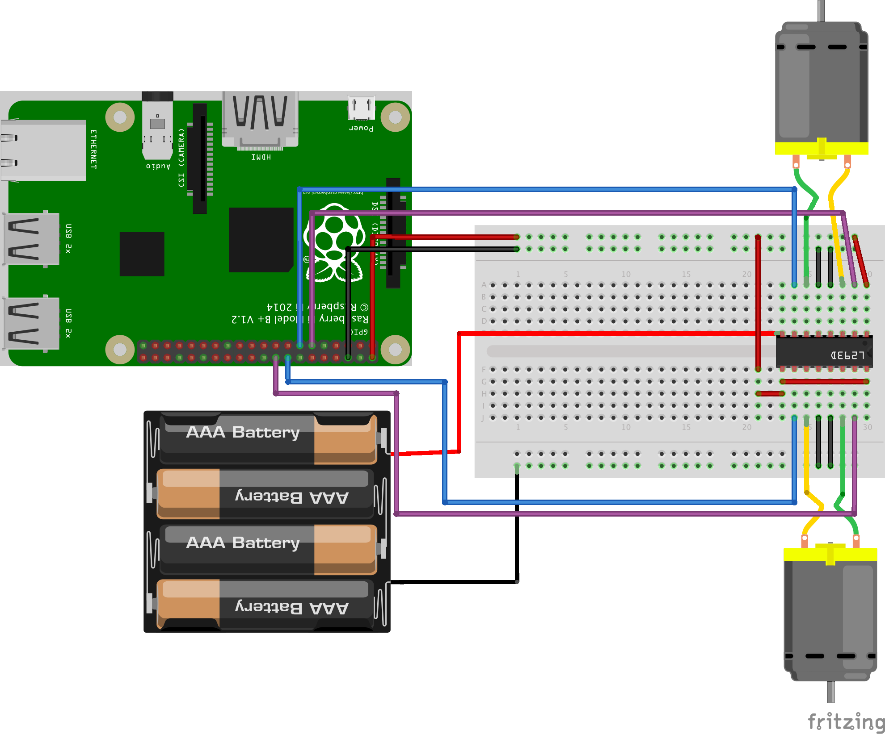

# Getting Started

## Background

This project is meant to provide instructions for a simple and expandable robot. This guide will evolve as new components are added. A side goal of this project is to provide learning material for my 2 daughters so I will try to make it as simple and create a shorter "kids" version.

## Required Materials 

Support local businesses! Links are to [Microcenter](https://www.microcenter.com) wherever possible. Microcenter is my hometown store (not sponsored).

* [Raspberry Pi][raspberry-pi-buy]
* [Jumper Cables][jumper-cables-buy] (All directions F2M M2M & F2F)
* [Breadboards][breadboard-buy]
* [Battery][battery-5v-buy] (5v for the pi)
* [Tac N' Stick][tac-n-stick-buy]
* [Motor Driver Controller][motor-driver-buy] (L293D)
* [Motors and Skateboard][body-buy]
    * I used this one but it was flimsy. I will work on a print your own protion shortly. However, you will still need 2 motors.
    * This also comes with a battery pack. You will need some sort of alternative power source for the motors.
* [Micro SD card][sd-card-buy]
    * Over 8 GBs
* AA Batteries (prefer rechargable)

## Optional
* [Various Sensors][sensors-buy]
* [Hard Jumper wires][hard-wire-buy]

[raspberry-pi-buy]: https://www.microcenter.com/product/473292/raspberry-pi-2-model-b
[jumper-cables-buy]: https://todo.com
[breadboard-buy]: https://www.microcenter.com/product/613877/inland-400-tie-points-breadboard---3-pack
[tac-n-stick-buy]: https://www.amazon.com/gp/product/B001CEMCXQ/ref=ppx_yo_dt_b_asin_title_o03_s01?ie=UTF8&psc=1
[battery-5v-buy]: https://www.amazon.com/gp/product/B07BSG7V3J/ref=ppx_yo_dt_b_asin_title_o03_s03?ie=UTF8&psc=1
[sensors-buy]: https://www.amazon.com/gp/product/B01MG49ZQ5/ref=ppx_yo_dt_b_search_asin_title?ie=UTF8&psc=1
[motor-driver-buy]: https://www.amazon.com/gp/product/B07NXTWJV9/ref=ppx_yo_dt_b_asin_title_o03_s03?ie=UTF8&psc=1
[hard-wire-buy]: https://www.microcenter.com/product/404582/elenco-jumper-wire-kit,-pre-formed,-140-pc
[body-buy]: https://www.amazon.com/gp/product/B01LXY7CM3/ref=ppx_yo_dt_b_search_asin_title?ie=UTF8&psc=1
[sd-card-buy]: https://www.microcenter.com/product/616252/kingston-64gb-canvas-select-plus-microsdhc-class-10--uhs-1-flash-memory-card-w--adapter-(2-pack)

## Assembley Pt 1

### Tools needed

* Soldering Iron
* Screw Driver (Phillips)

### Instructions

1. To start with assemble the motors and skateboard.
    1. You do not need to attach the switch.
    1. I would recomend stripping some of the M2M jumper wires and soldering them to the motors. This is the only soldering I did on my robot.
1. Use Tac N' Stick to stick the breadboard to the body
    1. TODO: Image showing state
1. Finally test the motor setup by wiring them up and making sure they work...
    

If the motors run you are ready for the next step.

## Setting up the Robot Brain            

### Tools Needed

* Keyboard
* Monitor

1. Create SD Card for Raspbian
    1. Download a copy of the newest version of [Raspbian](https://www.raspberrypi.org/downloads/raspbian/). 
        1. Raspbian is the operating system for Raspberry Pis
        1. I would recomend the "lite" version that does not include a Desktop, since the rest of this tutorial uses SSH.
    1. Next you will need to write the image you just downloaded to the SD Card. This can either be done via a [provided application or manually](https://www.raspberrypi.org/documentation/installation/installing-images/README.md).
1. Connect the keyboard and monitor then insert the SD Card into the Raspberry Pi. Finally, boot the device by hooking it up to power (outlet or the battery).
    1. You should see it boot on the monitor.
1. When the boot completes you should be prompted to login as pi with a default password of *raspberry*.
    1. Change the password using `passwd`
1. Run `rasp-config` and [setup wifi](https://www.raspberrypi.org/documentation/configuration/wireless/wireless-cli.md)
1. Install and setup ssh
    1. `sudo apt-get install openssh`
    1. **TODO**: Finish setup
    1. I would recommend setting up a static IP for the bot on the network. This enables communication and prevents the need to update IP everytime the device is booted.
1. **TODO**: Generate SSH key for device and SCP the key to the Raspberry Pi
1. **TODO**: Test SSH Connection from computer

## GPIO

In basic device programs there are a few main types of serial communication, the most basic is GPIO or General Purpose Input/Output. This is a great place to get started so that is what we will use in this blog.

## GPIO on Raspberry Pi 

Assuming you are using a Raspberry 2,3, or 4 you should see a pin set on the side. Here is an example...

You will notice some ports say 5v power, some ports say ground but the majority of the ports are labeled GPIO. You will also notice other acronyms like SDA, and SCL; these are for certain other "types" of [serial ports](https://www.robot-electronics.co.uk/i2c-tutorial).

We will need 4 pins (6 if you want to use the engage as well), so we will be using 27, 22, 23, 24.

## Round #1 Python

GPIO ports, as their name implies, have two basic functions: reading and writing. To do these two things we will need to interact with their representation in our operating system (in this case Raspbian). To do this we will by using a common scripting language called Python. We will, eventually use a more native language named simply C. However, that is a bit much for now. To test that we have Python properly installed run `python3` this should start Python. At the python command line type `quit()` to close the application

### TODO: If Python is not installed 

### TODO: Eventually this will be replaced to use 
### Add RPiGPIO to RobotBrain

RPiGPIO is a simple python library that will let us interact with the GPIO ports.

**TODO**: Install RPiGPIO

# Robot v1 Motors

## Wiring The L293D

Intro about why we want a controller instead of directly

### How does the L293D work?

** The top of the controller is signified by a small notch. ** 

First let's look at the pins... 

  
  * ### Left Side       
    * **Enable 1,2**: Turns on the motor that is wired into input 1 and 2.
    * **Input 1** Used to set motor 1/2 to forward
    * **Output 1** Connected to the Motor
    * **Ground** Connected to ground 
    * **Ground** Connected to ground          
    * **Output 2** Connected to the Motor
    * **Input 2** Used to set motor 1/2 to Backward
    * **Vcc2** Power from battery pack
  * ### Right Side       
    * **Vcc1** Power from Raspberry Pi 
    * **Input 3** Used to set motor 3/4 to forward
    * **Output 3** Connected to the Motor
    * **Ground** Connected to ground 
    * **Ground** Connected to ground          
    * **Output 2** Connected to the Motor
    * **Input 2** Used to set motor 1/2 to Backward
    * **Enable 3,4**: Turns on the motor that is wired into input 3 and 4.
       
So here is a sample diagram 

       